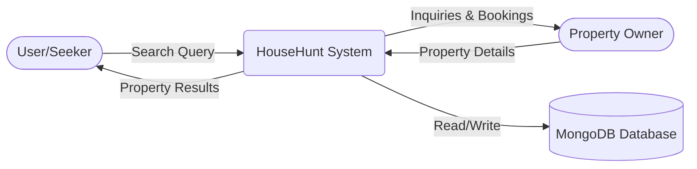

Project Design Phase-II

Data Flow Diagram & User Stories

| Date | 10 July 2026 |
|---|---|
| Team ID |  |
| Project Name | HouseHunt |
| Maximum Marks | 4 Marks |

Data Flow Diagrams:

A Data Flow Diagram (DFD) is a traditional visual representation of the information flows within a system. A neat and clear DFD can depict the right amount of the system requirement graphically. It shows how data enters and leaves the system, what changes the information, and where data is stored.

Example: (Simplified)

User Stories

Use the below template to list all the user stories for the product.

| User Type | Functional Requirement (Epic) | User Story Number | User Story / Task | Acceptance criteria | Priority | Release |
|---|---|---|---|---|---|---|
| Customer (Mobile user) | Registration | USN-1 | As a user, I can register for the application by entering my email, password, and confirming my password. | I can access my account / dashboard | High | Sprint-1 |
|  |  | USN-2 | As a user, I will receive confirmation email once I have registered for the application | I can receive confirmation email & click confirm | High | Sprint-1 |
|  |  | USN-3 | As a user, I can register for the application through Facebook | Account created via Facebook | Low | Sprint-2 |
|  |  | USN-4 | As a user, I can register for the application through Gmail | Account created via Gmail | Medium | Sprint-1 |
|  | Login | USN-5 | As a user, I can log into the application by entering email & password | User logs in successfully | High | Sprint-1 |
|  | Dashboard | USN-6 | As a user, I can view listed properties. | Properties displayed | High | Sprint-2 |
| Property Owner | Property Listing | USN-7 | As an owner, I can list my property. | Property added to database | High | Sprint-2 |
| Customer Care Executive |  |  |  |  |  |  |
| Administrator |  |  |  |  |  |  |
|  |  |  |  |  |  |  |
|  |  |  |  |  |  |  |
|  |  |  |  |  |  |  |

### Data Flow Diagram

